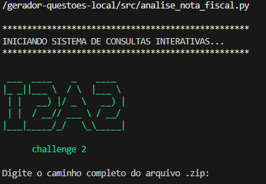
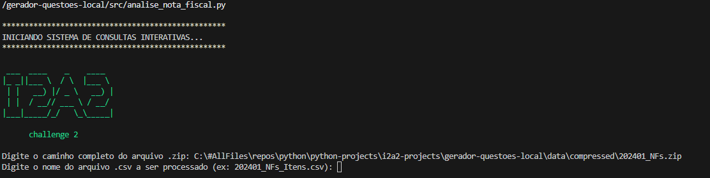
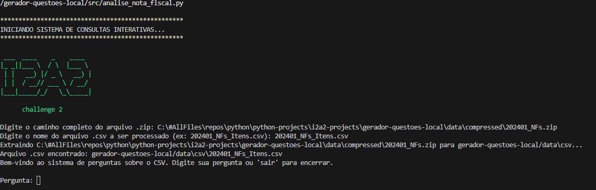

# Sistema Interativo de Consultas à Notas Fiscais

## Visão Geral
Esta solução permite a consulta de notas fiscais eletrônicas (NF-e) brasileiras de modo interativo na lingua portuguesa. 

Ela utiliza ferramentas de inteligência artificial que funcionam no seu computador, garantindo que seus dados permaneçam privados e sem custos de serviços na nuvem.

## Formato do Arquivo de Entrada

O arquivo CSV deve conter os seguintes campos, que descrevem detalhes das notas fiscais:

• CHAVE DE ACESSO: Identificador único da nota fiscal.
• MODELO: Tipo de documento (ex.: 55 para NF-e).
• SÉRIE: Série da nota fiscal (ex.: 001).
• NÚMERO: Número sequencial da nota.
• NATUREZA DA OPERAÇÃO: Tipo de transação (ex.: venda, devolução).
• DATA EMISSÃO: Data e hora de emissão da nota.
• CPF/CNPJ EMITENTE: CPF ou CNPJ de quem emitiu a nota.
• RAZÃO SOCIAL EMITENTE: Nome da empresa ou pessoa que emitiu a nota.
• INSCRIÇÃO ESTADUAL EMITENTE: Inscrição estadual do emitente.
• UF EMITENTE: Estado do emitente (ex.: SP, CE).
• MUNICÍPIO EMITENTE: Município do emitente.
• CNPJ DESTINATÁRIO: CPF ou CNPJ de quem recebeu a nota.
• NOME DESTINATÁRIO: Nome do destinatário.
• UF DESTINATÁRIO: Estado do destinatário.
• INDICADOR IE DESTINATÁRIO: Se o destinatário contribui com ICMS.
• DESTINO DA OPERAÇÃO: Local da transação (interna, interestadual, exterior).
• CONSUMIDOR FINAL: Indica se o destinatário é consumidor final.
• PRESENÇA DO COMPRADOR: Forma de compra (ex.: presencial, online).
• NÚMERO PRODUTO: Código do produto.
• DESCRIÇÃO DO PRODUTO/SERVIÇO: Nome do produto ou serviço.
• CÓDIGO NCM/SH: Código de classificação do produto.
• NCM/SH (TIPO DE PRODUTO): Tipo de produto segundo NCM/SH.
• CFOP: Código fiscal da operação.
• QUANTIDADE: Quantidade vendida.
• UNIDADE: Unidade de medida (ex.: unidade, kg).
• VALOR UNITÁRIO: Preço por unidade.
• VALOR TOTAL: Valor total do item.

## Instalação

Siga os passos abaixo para configurar a solução no seu computador (Windows).

1 - Instalar o Ollama:

Acesse https://ollama.ai, baixe e instale o executável para seu sistema operacional.

2 - Baixar o modelo Llama3:

Abra o Prompt de Comando (Windows) e execute:

cmd    ollama pull llama3

3 - Iniciar o serviço Ollama:

No mesmo Prompt execute:

cmd   ollama serve

IMPORTANTE: Mantenha o terminal aberto durante o uso da solução.

4 Instalar o git

   Baixe em https://git-scm.com se necessário.

5 - Clonar o repositório:

Baixe o código da solução usando o comando abaixo:

git clone https://github.com/mychelrios/i2a2-projects.git

5 - Instalar o Python:

Baixe e instale o Python (versão 3.8 ou superior) em https://www.python.org/downloads.

Confirme a instalação 

cmd python --version

6 - Instalar bibliotecas Python:

No Prompt de Comando ou Terminal, dentro da pasta gerador-questoes-local, execute:

pip install -r requirements.txt

## Utilização

Após a instalação, siga estas etapas para executar a solução:

1 - Execute o arquivo analise_nota_fiscal.py localizado na pasta gerador-questoes-local\src

   cmd python.exe analise_nota_fiscal.py

   A seguinte tela de apresentação será apresentada e o programa irá requerer a entrada do caminho completo para o arquivo .ZIP contendo os arquivos CSV

   Informe o caminho completo do arquivo .zip a ser descompactado e tecle Enter

   
   Agora informe o nome do arquivo .CSV contendo os dados das notas fiscais.

   A solução irá carregar o arquivo informado e irá disponibilizar o propt interativo para receber e responder aos questionamentos sobre os dados contidos no CSV.

Para  finalizar a interação com a solução, basta digitar sair. Bom uso ! 

## Limitações

A solução aceita apenas um arquivo CSV como fonte de dados.
O arquivo CSV deve seguir o formato especificado na seção "Formato do Arquivo de Entrada".
Requer um computador com recursos suficientes para executar o modelo Llama3 (recomenda-se 8 GB de RAM e GPU, se disponível).

